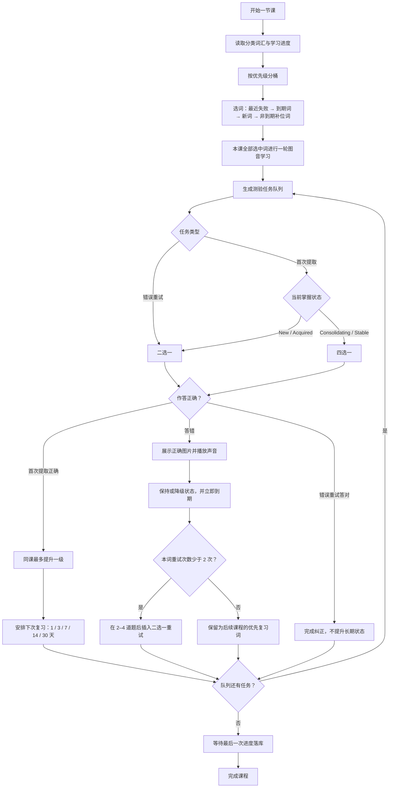

# 学习算法 v2

HopEnglish v2 将学习决策实现为纯 Dart `LearningEngine`。数据库和页面只提供事实并执行决策，不包含掌握、选词和间隔规则。

## 学习流程

## 掌握状态

| 状态 | 成功 | 失败 |
|---|---|---|
| New | Acquired，1 天后到期 | 保持 New，立即到期 |
| Acquired | Consolidating，3 天后到期 | 保持 Acquired，立即到期 |
| Consolidating | Stable，7 天后到期 | 降至 Acquired，立即到期 |
| Stable | 复习间隔提升至 14/30 天 | 降至 Consolidating，立即到期 |

- 同一节课内同一词最多提升一级。
- New/Acquired 使用二选一，Consolidating/Stable 使用四选一。
- 错误重试不提升长期掌握状态。
- Stable 仅表示稳定的声音—图片接受性识别。

## 课程策略

- 每课练习 5/6/8 个单词时，最多分别引入 3/3/4 个新词。
- 本课选中的新词和旧词都在测验前进行一轮图音接触。
- 选词优先级为：最近失败、到期 Acquired、到期 Consolidating、到期 Stable、新词、非到期补位词。
- 答错后晃动错误卡片并重播题目，用户选对后才进入下一题；同时在 2–4 道题后安排二选一重试，每词每课最多两次。
- `viewCount/playCount` 只用于同优先级排序，不作为掌握证据。

## 版本与复现

- 默认策略版本为 v2。
- 使用 `--dart-define=LEARNING_POLICY_VERSION=1` 可启用旧策略。
- 每个 `LessonPlan` 保存 `lessonId`、`policyVersion` 和 `randomSeed`；同样输入、时间与 seed 会生成相同决策。

## 数据迁移

数据库 schema v3 保守迁移旧测验数据：

- 无测验或连续正确为 0：New。
- 连续正确为 1：Acquired。
- 连续正确大于等于 2：Consolidating。
- 旧数据不会直接迁移为 Stable。
